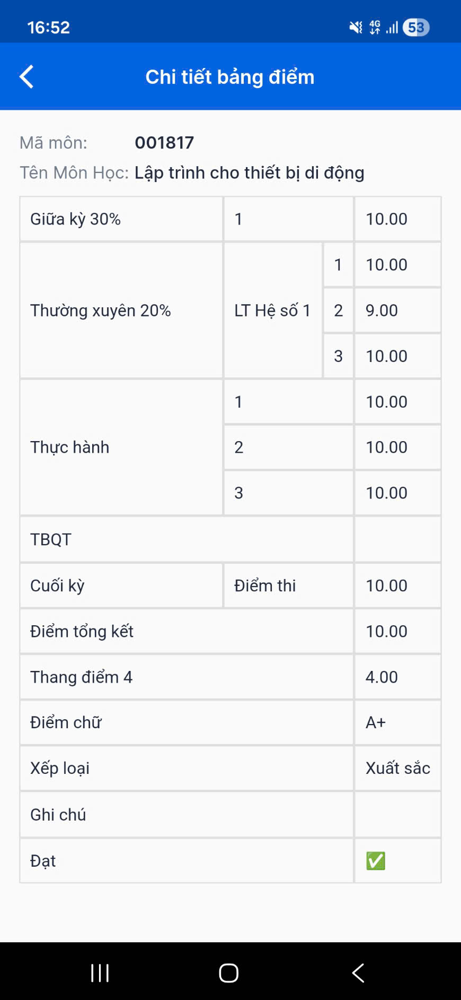

# React Native Lab IUH
Đây là các project học thực hành lập trình cho thiết bị di động ở trường hằng tuần.

## Nội dung
- Tuần 4: Ôn tập thường kỳ thực hành 1
- Tuần 6: Ôn tập giữa kỳ
- Tuần 10: Ôn tập thường kỳ thực hành 2
- Tuần 10+: Ôn thi cuối kỳ

## Góc khoe

## Youtube
- YouTube: https://www.youtube.com/@HuynhDucPhu2502
- Playlist “React Native”: https://youtube.com/playlist?list=PLImLByxRNRWP9N833Z9mkjJw6jw-Xv11B&si=TBLoPU8OJEfSekMi

